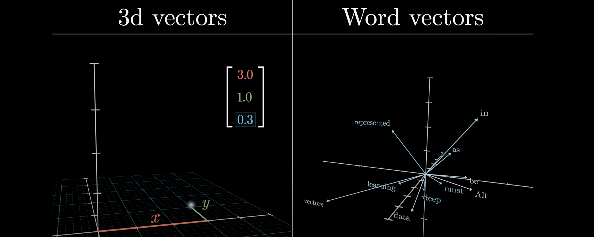

# RAG - is the cosine simulairty a hoax? Grabbing semantic meaning from text via math. 

Hypothesis: Randomly sampling chunks of text from a document may provide as much or even more useful context for an LLM than nearest neighbor retrieval, since nearest neighbor methods like Chroma’s Recursive Character Text Splitter sometimes return results that feel random or irrelevant to the query.

## Understanding Cosine Similarity in Text Analysis  

When we compare two pieces of writing, we often want a way to measure how alike they are beyond just matching words. This is where cosine similarity comes in. 

## What is Cosine Similarity?  

Cosine similarity measures how alike two pieces of text are by converting the text into numbers and placing them on a Cartesian graph. Rather than comparing the raw words, each grouped text is represented as a vector that captures a space location in the graph. You can see this in action via the video below. 

**YouTube link here:** [Cosine Similarity Diagram](https://youtu.be/wjZofJX0v4M?si=DlnUTSL0H-IAx5pW&t=731)
[](https://youtu.be/wjZofJX0v4M?si=DlnUTSL0H-IAx5pW&t=731)

 
## Why It Matters 

This technique became popular in information retrieval because it allows search engines and recommendation systems to quickly assess how closely a query matches a document. A cosine similarity score ranges from 0 to 1, where 0 means no similarity and 1 means the texts are identical in direction. Its strength lies in its simplicity and efficiency, making it a foundational tool in natural language processing, from clustering documents to detecting duplicate content. By focusing on the angle rather than magnitude, cosine similarity provides a balanced way to compare text regardless of word count.  


## What I’m Trying to Do

I’m building a retrieval-augmented generation (RAG) pipeline. My workflow takes long academic papers, splits them into chunks, embeds them with Hugging Face models like `all-MiniLM-L6-v2`, and stores them in a Chroma vectorstore. For fast search, I’m using an HNSW index under the hood. The goal is simple: when I ask a question, I want my retriever to give me the most relevant, diverse pieces of text from the document to feed into an LLM.

## What I’m Running Into - why is RAG feeding duplicate chunks from my vectorstore. 

Instead of diverse, informative chunks, I often get near duplicates. For example, I saw repeated solubility fragments appear in multiple top results:

```
[Chunk 1]
The feature shown in the top row has a positive predictive relationship with solubility...
Fragments most activated by pro-solubility feature &
Fragments most activated by anti-solubility feature &

[Chunk 2]
The feature shown in the top row has a positive predictive relationship with solubility...
Fragments most activated by pro-solubility feature &
Fragments most activated by anti-solubility feature &
```

This repetition is frustrating because it wastes valuable context window space without adding new information.

## Questions Around What I’m Running Into

* Is this a bug in HNSW?
* Is cosine similarity retrieval just inherently prone to duplicates?
* How can I make sure my retriever gives me varied and useful chunks instead of echoes of the same text?

## How I’m Feeling About All of This

Even after trying MMR, I realized chunking itself isn’t always great. For use cases like a full book, you really need stricter, structure-aware chunking. Cosine similarity on its own still feels a bit random, and that left me at a loss for a while. But at the same time, this whole process is exciting because the text I’m working with is dense enough to model something as big as a book, which means I’m testing ideas that scale to really challenging datasets. It feels awesome to see how these methods, when layered correctly, can handle that kind of density.

## Answers and How to Solve for It

### Why duplication happens

Duplication is not caused by HNSW. HNSW (Hierarchical Navigable Small Worlds) is a graph-based index that speeds up approximate nearest neighbor search. It organizes vectors into layers, navigates down greedily from the top, and does a best-first expansion at the bottom. Its job is to make retrieval faster and scalable, not to enforce diversity.

The real culprit is **cosine similarity with top-k retrieval**. If multiple chunks are nearly identical, their embeddings cluster tightly in vector space. A top-k query will happily return all of them because they all rank highly on closeness to the query.

### HNSW vs. cosine similarity top-k

* **Cosine similarity with top-k:** Highly susceptible to duplication, since it only cares about distance, not diversity.
* **HNSW:** Efficiently finds approximate nearest neighbors. It accelerates search but doesn’t change what neighbors are chosen.

For a clear walk-through of how HNSW works, check out this video: [HNSW Explained on YouTube](https://www.youtube.com/watch?v=77QH0Y2PYKg&t=407s).

### How to fix duplication

To reduce redundant chunks, you can:

* **Use Maximal Marginal Relevance (MMR):** MMR balances relevance and diversity, ensuring results cover different aspects of the document.
* **Clean your text:** Remove repeated figure captions, LaTeX artifacts, and other boilerplate before embedding.
* **Split smartly:** Use section-aware or semantic splitting instead of raw character-based splitting.
* **Hybrid retrieval and reranking:** Combine sparse (BM25) and dense retrieval, then apply a reranker like a cross-encoder to refine final results.

### Key takeaway

If you’re seeing duplicate chunks, it’s not a bug. It’s a known downside of cosine similarity top-k retrieval. The solution is to layer on strategies like MMR, smarter chunking, hybrid retrieval, and reranking so that your retriever delivers diverse, high-value evidence to your LLM instead of repeating itself. The fact that dense scientific text can already model a “book-scale” use case makes this an exciting space to experiment with, especially before scaling to full-length books.
